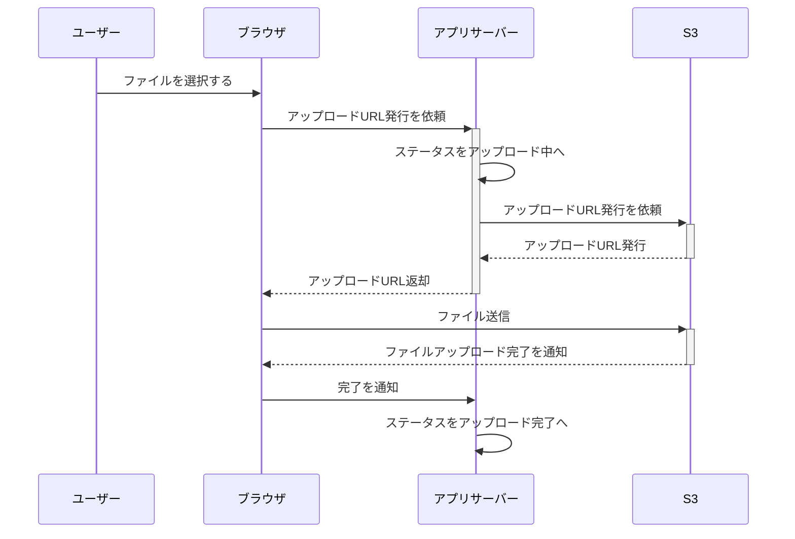
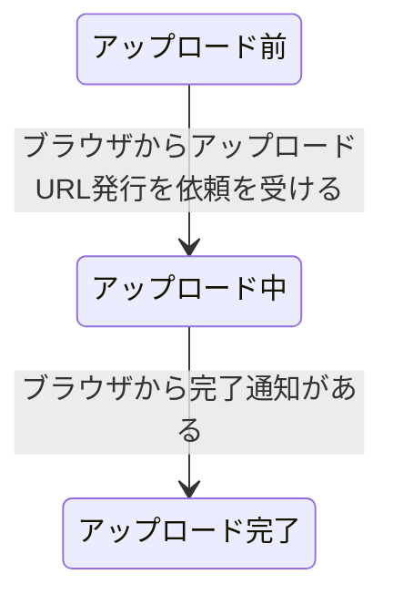

# 画像アップロード機能　詳細設計書

## 1. 今回の開発で実現されること・されないこと

### 実現されること
- 画像ファイルのアップロード機能
- 画像ファイルのS3への保存
- アップロードステータスの管理

### 実現されないこと
- アップロードした画像の利用機能
- 画像以外のファイル形式のアップロード
- アップロードに失敗した場合への対応

## 2. 入力データの制限
|項目|制限|
|---|---|
|対応ファイル形式|JPEG,PNG|
|最大ファイルサイズ|5MB|
|一度にアップロードできる画像数|5枚|

## 3. アップロード処理の流れ

### シーケンス図

### 状態遷移図(アプリサーバーのアップロードステータス) 

 